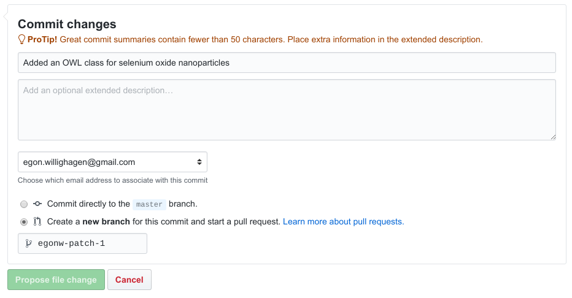

# Extending the eNanoMapper ontology

[prev](scholia.md) | [toc](./README.md) | [next](nanomaterial.md)

<script>
  function toggleAnswer(id) {
  var answer = document.getElementById(id);
  if (answer.style.visibility === "hidden" ||
      answer.style.visibility === "none") {
    answer.style.visibility = "visible";
  } else {
    answer.style.visibility = "hidden";
  }
}
</script>

---

This section of this workshop will not focus on adding ontology terms from any of the supported
upstream ontologies on which the eNanoMapper ontology is built. If you are interested in that,
please go to the [Adding ontology terms](https://github.com/enanomapper/tutorials/tree/master/Added%20ontology%20terms) 
tutorial. In that situation, you basically only need to determine
the IRI of the term to add and where in the eNanoMapper ontology it should be placed.

## OWL for a metal nanomaterial

In this example, you will reproduce a small OWL file that adds a nanomaterial to the ontology that
was not included yet. We will first see the full example and then discuss the components bit by bit.

So, let's make the jump in and briefly look at the full example. It uses OWL Axioms to provide
additional meaning to the ontology, useful for reasoning later (why?). Here it is:

```xml
<owl:Class rdf:about="http://purl.enanomapper.org/onto/ENM_9000245">
  <rdfs:subClassOf rdf:resource="http://purl.bioontology.org/ontology/npo#NPO_1384"/>
  <npo-ext:code rdf:datatype="http://www.w3.org/2001/XMLSchema#string">titanium nanoparticle</npo-ext:code>
  <rdfs:label xml:lang="en">titanium nanoparticle</rdfs:label>
  <owl:equivalentClass>
    <owl:Class>
      <owl:intersectionOf rdf:parseType="Collection">
        <rdf:Description rdf:about="http://purl.bioontology.org/ontology/npo#NPO_707"/>
        <owl:Restriction>
          <owl:onProperty rdf:resource="http://purl.bioontology.org/ontology/npo#has_component_part"/>
          <owl:someValuesFrom rdf:resource="http://purl.obolibrary.org/obo/CHEBI_33341"/>
        </owl:Restriction>
      </owl:intersectionOf>
    </owl:Class>
  </owl:equivalentClass>
  <synonym rdf:datatype="http://www.w3.org/2001/XMLSchema#string">Ti nanoparticle</synonym>
</owl:Class>
```

This snippet of OWL is written in the eXtensible Markup Language (XML) serialization.

We now will discuss this snippet in more detail. First, the snippet defines a new OWL class with
these instructions:

```xml
<owl:Class rdf:about="http://purl.enanomapper.org/onto/ENM_9000245">
</owl:Class>
```

The `<owl:Class>` part indicates information about a (new) class is given, while the `rdf:about`
part describes the IRI of the class. Because this IRI has not been used elsewhere, it defines a new
class.

Because ontologies are not meant for only machines but also for humans, we will add a few human
readable names: a code, a label, and a synonym. These RDF/XML lines are added:

```xml
  <npo-ext:code rdf:datatype="http://www.w3.org/2001/XMLSchema#string">titanium nanoparticle</npo-ext:code>
  <rdfs:label xml:lang="en">titanium nanoparticle</rdfs:label>
  <synonym rdf:datatype="http://www.w3.org/2001/XMLSchema#string">Ti nanoparticle</synonym>
```

To introduce some structure, a hierarchical `subclass` link is added:

```xml
  <rdfs:subClassOf rdf:resource="http://purl.bioontology.org/ontology/npo#NPO_1384"/>
```

### OWL Axioms

The next step is to add a more complex ontological relation to the ontology. After all, a titanium
nanoparticle `is basically` just a compound with a titanium `part` and it a `nanoparticle`. To define
this combination of terms, OWL Axioms can be used.

Now, the `is basically` is encoded in OWL as an `owl:equivalentClass`:

```xml
  <owl:equivalentClass>
    <owl:Class>
    </owl:Class>
  </owl:equivalentClass>
```

And the combination of the two is encoded in OWL with the `owl:intersectionOf`:

```xml
      <owl:intersectionOf rdf:parseType="Collection">
      </owl:intersectionOf>
```

Then, we want to be our new OWL class to be a nanoparticle, so the interaction should
include that it is a nanoparticle. This is done with this line:

```xml
        <rdf:Description rdf:about="http://purl.bioontology.org/ontology/npo#NPO_707"/>
```

But because not every nanoparticle is a titanium nanoparticle, we should also add a restriction
that the material should include titanium. This is done with the last few lines from our
original OWL class snippet:

```xml
        <owl:Restriction>
          <owl:onProperty rdf:resource="http://purl.bioontology.org/ontology/npo#has_component_part"/>
          <owl:someValuesFrom rdf:resource="http://purl.obolibrary.org/obo/CHEBI_33341"/>
        </owl:Restriction>
```

### Questions

1. How would you use an OWL Axiom to define a nanomaterial descriptor? <button onclick="toggleAnswer('q1')">Answer</button><span id="q1" style="visibility: hidden">You can define an `owl:equivalentClass` that the thing is a descriptor, but with the restriction that it is only computed for things that are nanomaterials, rather than all chemicals.</span>

## Adding new OWL Classes

A recent paper [[0](https://github.com/NanoSolveIT/10.1021-acsnano.8b07562)] has a nice
supplementary information section with toxicology data extracted from literature. The NanoSolveIT
project is currently making this data available to modellers.
As part of that process, the content needs to be annotated to with ontology terms, for example
for the nanomaterials that are studied.

Because the NanoParticle Ontology has had a limited set of nanoparticles defined, we routinely
have to add nanomaterials to the ontology. That is needed to have a unique ontology identifiers,
allowing us to specifically specify what we are talking about.

But for this paper, the following nanomaterials are still missing:

* Cr nanoparticle
* Co nanoparticle
* Bi nanoparticle
* Mo nanoparticle
* Co3O4 nanoparticle
* CdO nanoparticle
* MnO nanoparticle

Of course, first it must be checked if the NanoParticle Ontology and eNanoMapper Ontology indeed do
not contain these materials (check
[here]() and
[here]() as described in [Exercise 1](browsing.md)), and if they do not, they need to be added.

### Tasks

The goal of this part of the workshop is to develop an OWL Class definition for one of the missing
items (or, if you prefer, for a nanomaterial you worked on yourself and that is missing).

* Step 1: copy/paste the OWL Class definition (see []()):

```xml
<owl:Class rdf:about="http://purl.enanomapper.org/onto/ENM_9000245">
  <rdfs:subClassOf rdf:resource="http://purl.bioontology.org/ontology/npo#NPO_1384"/>
  <npo-ext:code rdf:datatype="http://www.w3.org/2001/XMLSchema#string">titanium nanoparticle</npo-ext:code>
  <rdfs:label xml:lang="en">titanium nanoparticle</rdfs:label>
  <owl:equivalentClass>
    <owl:Class>
      <owl:intersectionOf rdf:parseType="Collection">
        <rdf:Description rdf:about="http://purl.bioontology.org/ontology/npo#NPO_707"/>
        <owl:Restriction>
          <owl:onProperty rdf:resource="http://purl.bioontology.org/ontology/npo#has_component_part"/>
          <owl:someValuesFrom rdf:resource="http://purl.obolibrary.org/obo/CHEBI_33341"/>
        </owl:Restriction>
      </owl:intersectionOf>
    </owl:Class>
  </owl:equivalentClass>
  <synonym rdf:datatype="http://www.w3.org/2001/XMLSchema#string">Ti nanoparticle</synonym>
</owl:Class>
```

* Step 2: update the IRI and replace `ENM_9000245` with `ENM_9000xxx` (the ontology code will be assigned
  then your contribution gets incorporated into the released ontology)
* Step 3: replace the `npo-ext:code`, `rdfs:label`, and `synonym`
* Step 4: look up in the eNanoMapper ontology which more general ontology class is suitable for your
  materials, e.g. the IRI for
  `metal nanoparticle` or `metal oxide nanoparticle` and update the `rdf:subClassOf` line
* Step 5: look up in the ChEBI ontology which term it has for the chemical that is part of this particle
  and update the `owl:someValuesFrom` line in the code

When done, explain your solution with your neighbor (peer review) and consider submitting this term
to the eNanoMapper ontology. For this, and this is optional but very much appreciated (and
please do ask for help from the Workshop assistants), do:

* Step 6: Visit https://github.com/ and log in
* Step 7: Go to https://github.com/enanomapper/ontologies (and scan the README text)
* Step 8: Got to https://github.com/enanomapper/ontologies/blob/master/internal/npo-ext.owl
* Step 9: Look for the `Edit this file` link and click it
* Step 10: An editor will open, and you can add your contribution somewhere to this file.
* Step 11: When done, prepare the patch by scrolling to the bottom and adding a description of your work. The section
  to look for should look like:



* Step 12: After you submitted the patch, make a Pull Request


---

[prev](scholia.md) | [toc](./README.md) | [next](nanomaterial.md)

Copyright 2019 (C) Egon Willighagen - CC-BY Int. 4.0
