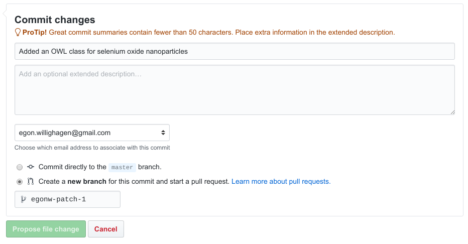

# Exercise 4: Adding a new nanoparticle to the ontology

[prev](extending.md) | [toc](./README.md) | [next](rdf.md)

---

Starting from the description in the [previous section](extending.md) of the OWL Class
definition of a nanomaterial, you will develop and OWL Class definition of a material that is
not in the ontology yet.

## Creating a new OWL Class definition for a nanomaterial

A recent paper [[0](https://github.com/NanoSolveIT/10.1021-acsnano.8b07562)] has a nice
supplementary information section with toxicology data extracted from literature. The NanoSolveIT
project is currently making this data available to modellers.
As part of that process, the content needs to be annotated to with ontology terms, for example
for the nanomaterials that are studied.

Because the NanoParticle Ontology has had a limited set of nanoparticles defined, we routinely
have to add nanomaterials to the ontology. That is needed to have a unique ontology identifiers,
allowing us to specifically specify what we are talking about.

But for this paper, the following nanomaterials are still missing:

* Cr nanoparticle
* Co nanoparticle
* Bi nanoparticle
* Mo nanoparticle
* Co3O4 nanoparticle
* CdO nanoparticle
* MnO nanoparticle

Of course, first it must be checked if the NanoParticle Ontology and eNanoMapper Ontology indeed do
not contain these materials (check
[here]() and
[here]() as described in [Exercise 1](browsing.md)), and if they do not, they need to be added.

### Tasks

The goal of this part of the workshop is to develop an OWL Class definition for one of the missing
items (or, if you prefer, for a nanomaterial you worked on yourself and that is missing).

* Step 1: copy/paste the OWL Class definition (see []()):

```xml
<owl:Class rdf:about="http://purl.enanomapper.org/onto/ENM_9000245">
  <rdfs:subClassOf rdf:resource="http://purl.bioontology.org/ontology/npo#NPO_1384"/>
  <npo-ext:code rdf:datatype="http://www.w3.org/2001/XMLSchema#string">titanium nanoparticle</npo-ext:code>
  <rdfs:label xml:lang="en">titanium nanoparticle</rdfs:label>
  <owl:equivalentClass>
    <owl:Class>
      <owl:intersectionOf rdf:parseType="Collection">
        <rdf:Description rdf:about="http://purl.bioontology.org/ontology/npo#NPO_707"/>
        <owl:Restriction>
          <owl:onProperty rdf:resource="http://purl.bioontology.org/ontology/npo#has_component_part"/>
          <owl:someValuesFrom rdf:resource="http://purl.obolibrary.org/obo/CHEBI_33341"/>
        </owl:Restriction>
      </owl:intersectionOf>
    </owl:Class>
  </owl:equivalentClass>
  <synonym rdf:datatype="http://www.w3.org/2001/XMLSchema#string">Ti nanoparticle</synonym>
</owl:Class>
```

* Step 2: update the IRI and replace `ENM_9000245` with `ENM_9000xxx` (the ontology code will be assigned
  then your contribution gets incorporated into the released ontology)
* Step 3: replace the `npo-ext:code`, `rdfs:label`, and `synonym`
* Step 4: look up in the eNanoMapper ontology which more general ontology class is suitable for your
  materials, e.g. the IRI for
  `metal nanoparticle` or `metal oxide nanoparticle` and update the `rdf:subClassOf` line
* Step 5: look up in the ChEBI ontology which term it has for the chemical that is part of this particle
  and update the `owl:someValuesFrom` line in the code

## Contributing your work to the eNanoMapper ontology

When done, explain your solution with your neighbor (peer review) and consider submitting this term
to the eNanoMapper ontology. For this, and this is optional but very much appreciated (and
please do ask for help from the Workshop assistants), do:

* Step 6: Visit https://github.com/ and log in
* Step 7: Go to https://github.com/enanomapper/ontologies (and scan the README text)
* Step 8: Got to https://github.com/enanomapper/ontologies/blob/master/internal/npo-ext.owl
* Step 9: Look for the `Edit this file` link and click it
* Step 10: An editor will open, and you can add your contribution somewhere to this file.
* Step 11: When done, prepare the patch by scrolling to the bottom and adding a description of your work. The section
  to look for should look like:



* Step 12: After you submitted the patch, make a Pull Request

---

[prev](extending.md) | [toc](./README.md) | [next](rdf.md)

Copyright 2019 (C) Egon Willighagen - CC-BY Int. 4.0
