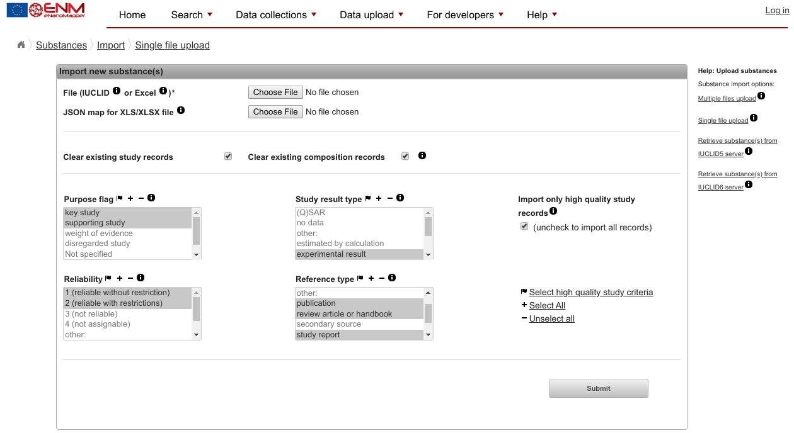
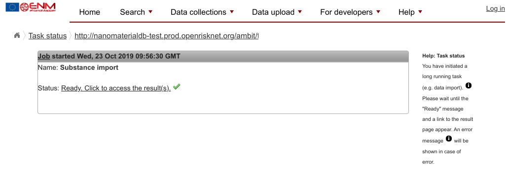

# Exercise 5: creating an eNanoMapper data set in RDF

[prev](nanomaterial.md) | [toc](./README.md)

---

In this final exercise, you are going to write a short data file capturing some minimal
metadata about a recently published study around nanosafety.

Take the situation you published a new nanosafety study about some nanoparticle. And you want people to discover
your new work if they search for studies on that nanoparticle. This Exercise will explain how to make your
article more findable, fulfilling one of the requirements of FAIR data.

We basically start with a nanoparticle, the DOI of the article, and some info of who you are. This information
can be submitted in various ways, but we here focus on a simple RDF-based file, which you can edit with a simple
text editor, like Notepad. This write up is a shorter version of [this longer tutorial](https://nanocommons.github.io/tutorials/enteringData/).

* Step 1: Open a text editor (e.g. `Notepad.exe` or TextMate)

After that, and because the document will be a valid RDF document, we need to specify a few shortcuts, which
are called `namespaces` in RDF documents.

* Step 2: Add the following namespace definitions to your document (or copy/paste [this full template](template.ttl)):

```turle
@prefix bao:   <http://www.bioassayontology.org/bao#> .
@prefix cito:  <http://purl.org/net/cito/> .
@prefix dc:    <http://purl.org/dc/elements/1.1/> .
@prefix dcterms: <http://purl.org/dc/terms/> .
@prefix foaf:  <http://xmlns.com/foaf/0.1/> .
@prefix npo:   <http://purl.bioontology.org/ontology/npo#> .
@prefix obo:   <http://purl.obolibrary.org/obo/> .
@prefix owner: <https://openrisknet.github.io/workshops/demo/owner/> .
@prefix rdf:   <http://www.w3.org/1999/02/22-rdf-syntax-ns#> .
@prefix rdfs:  <http://www.w3.org/2000/01/rdf-schema#> .
@prefix sio:   <http://semanticscience.org/resource/> .
@prefix void:  <http://rdfs.org/ns/void#> .
@prefix xsd:   <http://www.w3.org/2001/XMLSchema#> .
```

## Info about us

The first bit of information that a FAIR data set needs, is a bit of information about the data set.

* Step 3: Use the below template to describe your data set:

```turtle
owner:DataSet1
        a                   void:Dataset ;
        dcterms:license     <https://creativecommons.org/publicdomain/zero/1.0/> ;
        dcterms:publisher   "Egon Willighagen"@en ;
        dcterms:description "Nanomaterials I am excited about."@en ;
        dcterms:title       "Exciting nanomaterials"@en .
```

* Step 4: Change the `dcterms:publisher`, `dcterms:description`, and `dcterms:title` values. For
  convenience, you can extend the description to include the citation to your research article.

## Info about your nanomaterial

The next bit of information is about the nanomaterial. Here, the template looks like this:

```turtle
owner:Substance1
        a                obo:CHEBI_59999 ;
        rdfs:label       "zinc oxide" ;
        dcterms:source   owner:DataSet1 ;
        dcterms:type     npo:NPO_1542 .
```

In this template, the `obo:CHEBI_59999` is used to indicate that this resource is a chemical substance.
You can update the `rdfs:label` to match your material, and the `dcterms:source` says that this material
is part of the data set you created before.

Besides the label for the material, the second important thing to change here is the type of your
material. This is where the earlier exercise come in. There you looked up an eNanoMapper ontology IRI
or even minted a new IRI. This IRI is what you need for the `dcterms:type` line.

* Step 5: Update the material template for the name of your material and the IRI of your material

If you material has coatings, please refer to the longer tutorial for examples on how to do that.

## Adding the size of your material

In the RDF discussed here, the data model of the BioAssay Ontology is reused for physicochemical
properties too. This model is very flexible and rich, but therefore also somewhat longer. We
define an assay (`owner:particleSizeAssay`), a measurement group (`owner:Substance1_sizemg`),
and finally the size (`owner:Substance1_size`):

```turtle
owner:Substance1
        obo:BFO_0000056  owner:Substance1_sizemg .

owner:particleSizeAssay
        a                npo:NPO_1694 , bao:BAO_0000015 ;
        dc:title         "Particle Size" ;
        bao:BAO_0000209  owner:Substance1_sizemg .

owner:Substance1_sizemg  a  obo:BAO_0000040 ;
        obo:OBI_0000299  owner:Substance1_size .

owner:Substance1_size  a    bao:BAO_0002128 ;
        rdfs:label       "primary particle size" ;
        sio:has-unit     "nm" ;
        sio:has-value    "13.6" .
```

In this template, basiclly only the resource IRIs ((`owner:Substance1_sizemg`) and (`owner:Substance1_size`))
change when you add more than one material.

But if you only want to describe during this workshop one nanomaterial, then you only need to change the
actual size value, on the last line of this bit of template.

Step 6: Copy/paste this template code into your text editor, and update the size

## Linking the particle to your article

The final step in creating the RDF is to link your particle description to the article where you studied
your particle. This is the template, and note that the article is linked to the physicochemical data,
rather than the particle:

```turtle
owner:Substance1_size cito:usesDataFrom <https://doi.org/10.1021/es900754q> .
```

Step 7: Copy/paste this template and update the DOI in the IRI.

## Uploading the RDF to the OpenRiskNet cloud

When done, explain your solution with your neighbor (peer review) and see if they agree with your formal description.
You can also use [this validation service](http://ttl.summerofcode.be/) to check the content of your file
for syntax errors. The feedback from this
service is easier to understand, than the below OpenRiskNet service will return.

When the file is done, you can then proceed to the following and upload your RDF into the OpenRiskNet platform:

* Step 8: Visit the OpenRiskNet eNanoMapper instance at [http://nanomaterialdb-test.prod.openrisknet.org/ambit/](http://nanomaterialdb-test.prod.openrisknet.org/ambit/)
* Step 9: At the top, hover over `Data upload` and click `Spreadsheet upload`. You should get a page that looks like this:



* Step 10: Ignore the mention of spreadsheets (it will load valid Turtle fine) and ignore *all* parameters on this page.
* Step 11: Use the top `Choose file` button to select the file you created with your text editor
* Step 12: Click Submit at the bottom

If all goes well, you should get a "Ready" message that looks like this:



If you did not get a "Ready" message, then there is likely something wrong with your data file. Please discuss
this with one of the Workshop assistents.

* Step 13: Visit [http://nanomaterialdb-test.prod.openrisknet.org/ambit/substanceowner](http://nanomaterialdb-test.prod.openrisknet.org/ambit/substanceowner) to confirm you see your data set

---

[prev](nanomaterial.md) | [toc](./README.md)

Copyright 2019 (C) Egon Willighagen - CC-BY Int. 4.0
