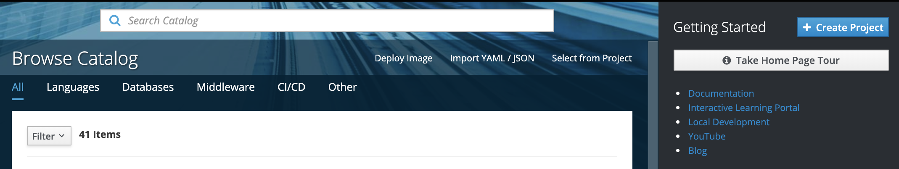
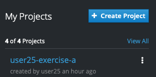
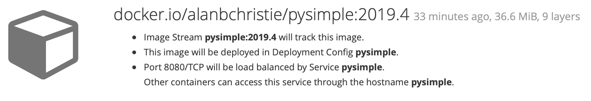
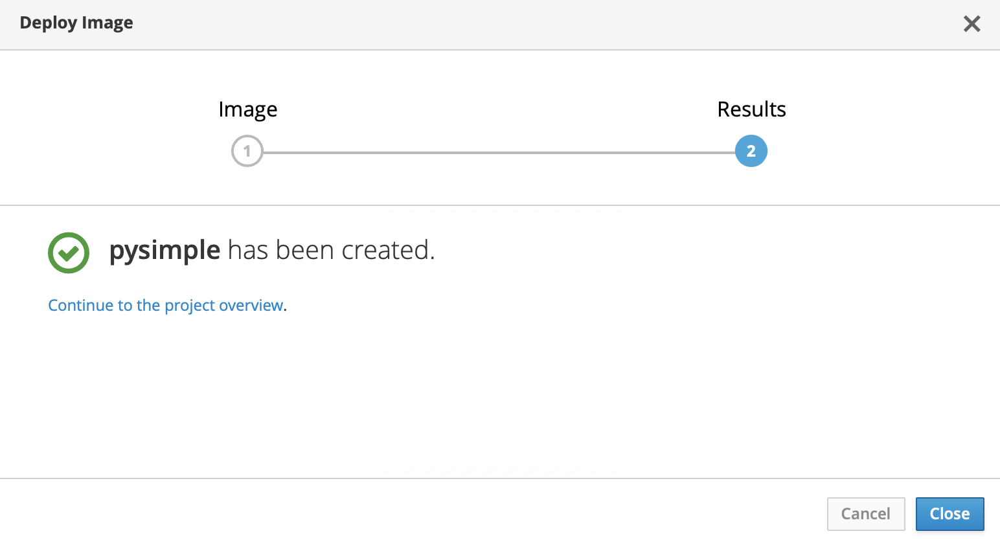
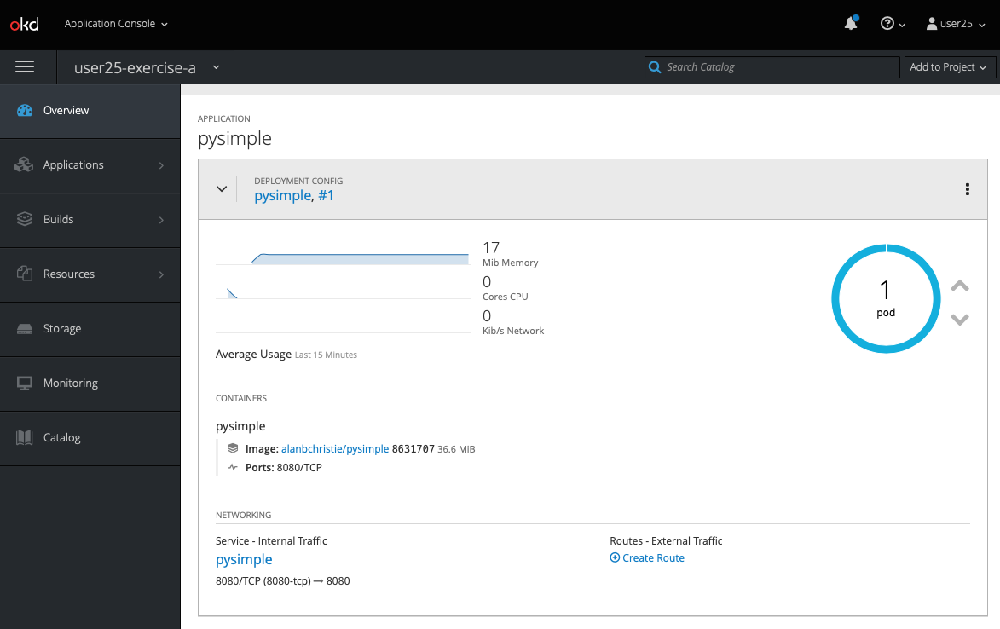
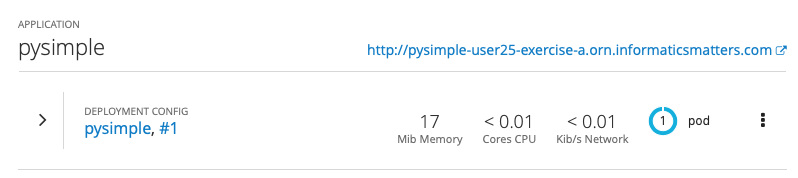

# Development Workshop - Exercise A

[toc](../README.md) | [prev](../tutorial-1/README.md) | [next](../tutorial-2/README.md)

Here we deploy the **PySimple** image using the OpenShift Web Console.

---

This exercise uses the OpenRiskNet OpenShift Web Console to deploy a
container image from a public registry (docker.io). 

The container we use is **PySimple**, a small Python web server application
that we'll use in several places in this workshop.

-   You can find the **source code** of the example's container image
    on [GitHub](https://github.com/alanbchristie/PySimple)
-   You can find details of the corresponding **container image**
    on [Docker Hub](https://hub.docker.com/r/alanbchristie/pysimple)

## Log into the server
Using a web browser (ideally Google Chrome) navigate to the OpenRiskNet
OpenShift Development Web Console at
[https://dev.openrisknet.org:8443/](https://dev.openrisknet.org:8443/)
where you'll be presented with the login page and enter the **username**
and **password** you've chosen.

## Creating a project (namespace)
Applications are deployed to _namespaces_. Note: we use the terms
**project** and **namespace** interchangeably.

1.  To create a project (namespace) for the application click the
    blue **+ Create Project** button in the top-right of the console.
    
    

1.  Provide a **Name** for the project.

    Project names may only contain lower-case letters, numbers, and dashes
    and must begin with a letter or number. The name is arbitrary but,
    according to our workshop convention, let's call it `user99-exercisea`
    (replace `user99` with your username).
    
    1.  You can provide an optional **Display Name**, which does not have the
        same content restrictions as the **Name**, and a **Description**

1.  Click **Create** and you should receive a
    `Project 'user1-exercisea' was successfully created`
    notification as your project appears in the **My Projects**
    panel.

    

## Deploying the application image
You deploy applications from within a project.

1.  From the list of your projects click the **PySimple** project you just
    created. Here you should be greeted by a page explaining how you can
    **Get started with your project**.

1.  Click the **Deploy Image** button and select the **Image Name** option.

1.  To deploy a pre-built container image we simply enter the registry name
    and tag of the image we want to deploy. As we're using a pre-existing image
    simply enter the image name, e.g. `alanbchristie/pysimple:2019.4`
    and then hit **Return**.
    
    Without a registry OpenShift assumes `docker.io`
    but you can add a registry if you want e.g. `docker.io/alanbchristie/pysimple:2019.4`.

1.  OpenShift queries the image and, after a few moments, displays
    some brief information about it.
    
    
    
    You will see that it understands that the image opens port `8080` and
    so a **Service** to access that port will be created.
    
    If you scroll down you will see sections relating to naming, variables
    and labels: -
    
    1.  You can change the **Name** of the image, but we'll leave it as
        `pysimple`.
    1.  You have an opportunity to define **Environment Variables**. As
        `pysimple` does not require any we can can skip this.
    1.  You can also add **Labels** to objects that get created.
        It's unnecessary for this example so leave these at their default
        values.

1.  Click the blue **Deploy** button in the boot-right of the panel
    to deploy the application and you should be presented with a
    confirmatory screen like this: -

    

Click the **Continue to the project overview** link
to be taken to your project's **Overview** panel.

## Project overview
The overview is a general view of your project's objects.

As the PySimple image is quite small (around **38MB**) it might be already running
by the time you visit the overview page. If not you should see the application
deployment progress where the image is first pulled from the public registry,
passing through an initialisation phase before settling down into a running
state, indicated by a blue circle.

When the application is running you should eventually see an **Overview**
like this: -

## Adding a Route
In order to access an application's **Service** from outside the cluster
you need to add a **Route**.

1.  From the project **Overview** page click the **+ Create Route** text on the
    right-hand-side of the **NETWORKING** section.
    
    For this example you can leave all the options at their default values
    in order to create an unsecured **Route** from outside the cluster to the
    application's **Service**.
    
1.  Click the blue **Create** button at the bottom of the screen and you
    should see a `Route pysimple was successfully created` notification
    appear.
    
You will be returned to a compact view of the projects's **Overview**
and you should now have a URL link that can be used to connect you to the
application.

Click the URL link and to be taken to the **PySimple** HTTP
page, where you'll see the application's _Hello World!_ screen: -
 
    Hello world!
    
    Hostname: pysimple-1-npn5b
    Num visits: 1

## Delete the project
Clean up by deleting the project.

1.  To delete the project, which deletes the namespace and all the objects we've
    created (including the Route), navigate to your console's landing page
    by clicking the **okd** icon in the top left of the console window.
    
1.  You should be returned to the start and you should see the **My Projects**
    panel on the right.
    
1.  Click the vertical ellipses (`...`) and select **Delete Project**.
    1.  Enter you project **Name** (e.g. `user99-exercisea`) in the dialogue box
        and then click the red **Delete** button to begin the deletion process.
    1.  The project is _marked for deletion_ and on larger projects deletion
        can take some time. But this small project should be removed in a
        few moments, disappearing from the **My Projects** sidebar when it has.

---

[toc](../README.md) | [prev](../tutorial-1/README.md) | [next](../tutorial-2/README.md)
