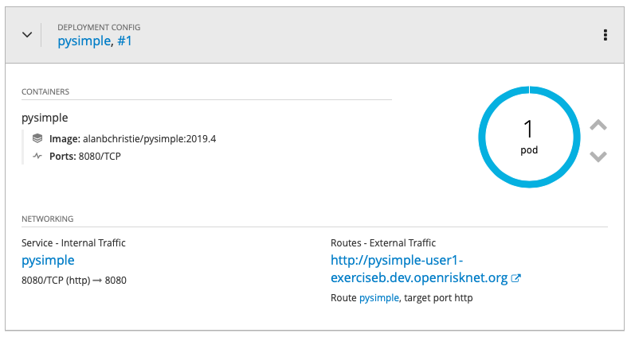
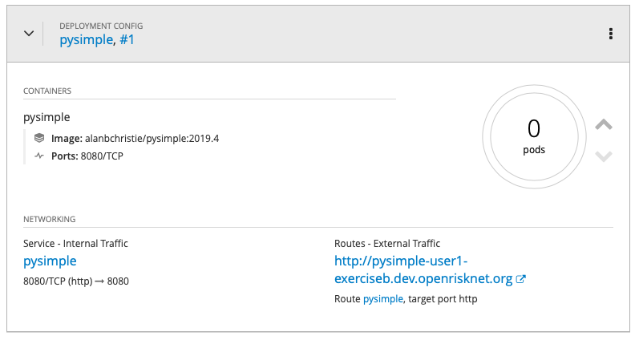

# Development Workshop - Exercise B

[toc](../README.md) | [prev](../tutorial-2/README.md) | [next](../exercise-c/README.md)

In this exercise we deploy the **PySimple** image from the OpenShift Command-Line.

---

>   This exercise is a repeat of **Exercise A**, which deployed the application
    using the OpenShift Web Console. In this exercise we use OpenShift's
    command-line tools.

>   For a full list of available commands you can visit the OpenShift v3.11
    [CLI reference] page.

## Installing the command-line tools
Follow the instructions in the **Log into the server** section of
[Exercise A](../exercise-a/README.md).

From the login page select the **Command Line Tools** option from the **Help**
dialogue (the **?** in a circle icon). You will have a link to the
**Latest Release** for OpenShift 3.11 where you can download and unpack a
suitable package for your OS (linux, Mac, Windows).

_SCREENSHOT_

The **Command Line Tools** page also provides you with a login command and
_token_ to allow you to login to the OpenShift server from outside the cluster.

_SCREENSHOT_

## Login
Login to the server by copying the example login command you were given on the
**Command Line Tools** page, which will be something like this: -

    oc login https://dev.openrisknet.org:8443
    ...

## Creating a namespace (project)
Use the command-line to create a project: -

    oc new-project user99-exerciseb

Replace `user99` with your actual username (similarly for other commands in
this exercise which refer to `user99`). Project names in OpenShift have global
scope so we must have unique names, hence why we include the username as part
of the project name.

>   Using `--display-name` and `--description` for the `new-project` command
    is encouraged but optional.

## Deploying the application image
You deploy applications from within a project.

You are automatically entered into new projects as you create them but you can
always make sure you're in the right project with the command: -

    oc project user99-exerciseb

You can see which project you're in with the command: -

    oc project

We can now deploy the application.

We could do it in a similar way to the way we did with the web console and
just say create a new app with the PySimple container, but instead we'll do
this is a more controlled manner using templates that define the OpenShift
objects that we are wanting to be created. 

But first we need to briefly discuss OpenShift _templates_.

As we're not using the console we use files to provide templates that describe
the object that are need to satisfy the application.

To do this we need to understand what Kubernetes objects will be required
to deploy an application. This is not always obvious, made more complex
by the fact that there are large number of objects available in Kubernetes.

>   We don't have time to explain templates or the objects they describe in
    detail in this exercise but we have created the templates for PySimple
    for you.

In this exercise we need templates to create: -

-   the application container (using a **DeploymentConfiguration**)
-   a port for HTTP communication (using a **Service**)
-   an external route (using a **Route**)

Templates are typically crafted using YAML-based text files. You can find
our ready-made templates in the exercise directory.

>   You can combine all of your objects into a single _template_ file but
    it's often wise to arrange your application objects using a
    _one-file-one-object_ pattern, which can help when automating
    deployments.

To deploy the application we need to use the command-line to _process_
each template, a command that compiles the YAML file into a form usable by
OpenShift. We then _create_ objects from the processed result.

From the `exercise-b` directory we can install the application's container
(a **DeploymentConfiguration**), its *Service**  and **Route** with the
following commands: -

    oc process -f deployment-config.yaml | oc create -f -
    oc process -f service.yaml | oc create -f -
    oc process -f route.yaml | oc create -f -

If you navigate to the OpenShift web console you should see your project
and, once the container is pulled from DockerHub and is running the
**Overview** screen, once expanded, should look something like this: -

    
Click on the route's link to visit the application, or you can use
`curl` from the command-line: -

    curl http://pysimple-user99-exerciseb.dev.openrisknet.org/

## Scaling the application
With the application running we can scale it up and down by
setting the number of _replicas_ for the application's container.

>   The initial replica count is declared in the **DeploymentConfig** template
    file but we can easily adjust it from the command-line.

To scale our application's container replica count to zero,
stopping the container, we can run: -

    oc scale deploymentconfig/pysimple --replicas=0

If you visit the **Overview** page for your application you will see
that the container (known as a **Pod** on Kubernetes) has been scaled to
zero: -

>   Many object names can be abbreviated, the above command can
    also be shortened   to: -

        oc scale dc/pysimple --replicas=0

The replica state can also be confirmed by _describing_ the deployment
object using the command-line tools: -

    oc describe dc/pysimple | grep Replicas

Which should return something like the following: -

    Replicas:	0
	Replicas:	0 current / 0 desired

To restore the original replica value of 1 it's simply: -

    oc scale dc/pysimple --replicas=1

## Investigating resiliance
Let's see what happens if your container (**Pod) dies. 

>   It will more dramatic if you have the console's application **Overview**
    screen visible while you run the next few commands.
 
First list your pods:

    oc get pod

...and copy its name (something like `pysimple-1-4df47a5`).

Now let's delete the pod, simulating the situation where it might have crashed,
or the server on which it was running crashed.

    oc delete pod/pysimple-1-4df47a5

Replace the last part with the actual name of your pod. And, yes,
**really** delete it. No harm will be done!

>   If you do have te **Overview** screen visible you'll get a dynamic visual
    rendering of what happens to deployments of Pods that die. Alternatively,
    for a less dramatic view execute `oc get pod`.

You will notice that quite quickly OpenShift will notice that the required
number of pods are not running and will rectify this by starting a new pod.

OpenShift creates a new running instance of your container image and
might possibly even use a different physical compute instance on which to
run it.

## Delete the project
Clean up by deleting the project.

To delete the PySimple project simply run: -

    oc delete project/user99-exerciseb
    
As project deletion can take a some time you can always wait for deletion
with the command: -

    oc wait project/user99-exerciseb --for=delete

Which may conclude with the message: -

    Error from server (NotFound): namespaces "user1-exerciseb" not found

---

[toc](../README.md) | [prev](../tutorial-2/README.md) | [next](../exercise-c/README.md)

[cli reference]: https://docs.openshift.com/container-platform/3.11/cli_reference/basic_cli_operations.html
