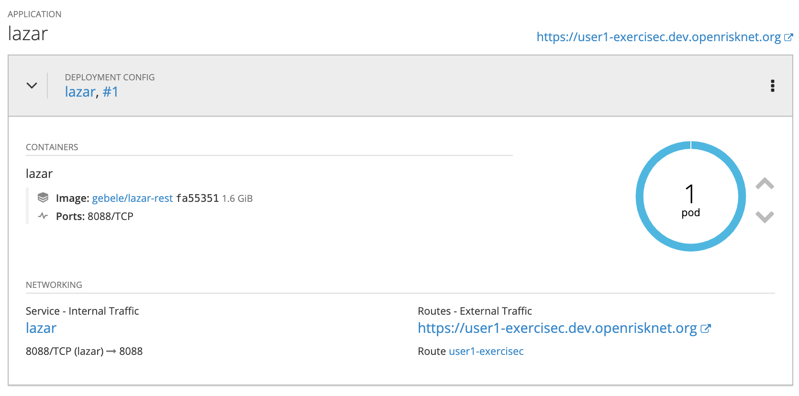
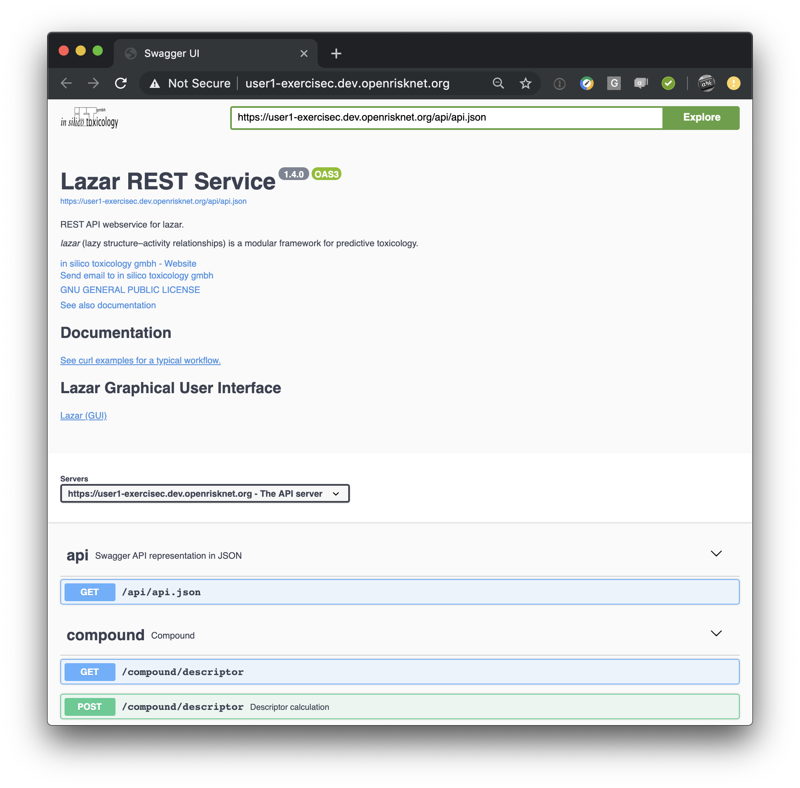

# Development Workshop - Exercise C

[toc](../README.md) | [prev](../exercise-b/README.md) | [next](../tutorial-3/README.md)

In  this exercise we deploy a real-world OpenRiskNet application (**Lazar**)
from the OpenShift Command-Line.

**W O R K -  I N - P R O G R E S S**

---

>   The OpenRiskNet **Lazar** predictive toxicology service application is
    briefly described on the OpenRiskNet [deployments page]. Here we'll
    concentrate on the deployment of the application.

## Login
If you need to, login to the server: -

    oc login https://dev.openrisknet.org:8443
    ...

## Creating a namespace (project)
Use the command-line to create a project: -

    oc new-project user99-exercisec

## Deploying the application image
The OpenShift deployment of **Lazar** is defined in a single YAML file,
replicated in this exercise directory. It consists of the following objects: -

-   An **ImageStream**
-   A **DeploymentConfig**
-   A **Service**
-   A **Route**

In its simplest form an **ImageStream** is a Docker image identified by a
tag (it's actually much more than that but we don't have time to go into the
detail of each object). Lazar uses it as a 'trigger' for the container image
so the **Pod** automatically re-deploys when the image changes.

>   You can read more about ImageStreams in the [image streams section] of
    the OpenShift documentation.

Incidentally, it's often more flexible to restrict OpenShift templates to a
*one-file-one-object* scheme. This is not always possible, especially
where parameters need to be shared between closely related objects.
But it is a reason to consider the use of playbooks or roles that employ
the Ansible **k8s** module.

>   The template we're using has been adjusted for the workshop.
    The latest production template and documentation can be found on the
    OpenRiskNet site's [deployments page].

### Parameters
**Lazar** is controlled through the use of a number of **Parameters**,
defined in its OpenShift template so we need to understand how we can *override*
template parameters from the command-line before we can install it as its
default parameter values may not be appropriate for our use.
If you inspect the `lazar.yaml` template you'll see default values for
parameters like the `IMAGE_NAME` and `ROUTE_NAME`.

You can change parameter values on the command-line via the `process` command's
`-p` option. We'll see that when we put all this together in the next section.

### Putting it all together

>   Because several users may be running this Exercise at the same time
    we *must* change one parameter, the `ROUTE_NAME`. We can't all deploy **Lazar**
    and use the same **Route** name. We can do this simply by using our username.

    oc process -f lazar.yaml -p ROUTE_NAME=user1-exercisec | oc create -f -

Lazar is a large and complex application, that may take a few moments to
become 'ready'. You can visit the project **Overview** page to see the
deployment state of the application. At some point it should settle down
and you should see the **Pod** with its familiar blue outline, the **Service**
and **Route**: -

When 'ready' you should be able to navigate to the application's landing page
using the **Route** link: -

>   The **Lazar** **Route** expects secure traffic via the HTTPS protocol.
    Insecure traffic is redirected. Consequently you may be warned about this
    by your browser. For now you should acknowledge the security warning and
    proceed to the application website. Feel free to inspect the template to
    see these object properties.

## Delete the project
Clean up by deleting the project.

    oc delete project/user99-exercisec
    
---

[toc](../README.md) | [prev](../exercise-b/README.md) | [next](../tutorial-3/README.md)

[deployments page]: https://github.com/OpenRiskNet/home/tree/master/openshift/deployments/lazar
[image streams section]: https://docs.openshift.com/enterprise/3.0/architecture/core_concepts/builds_and_image_streams.html#image-streams
