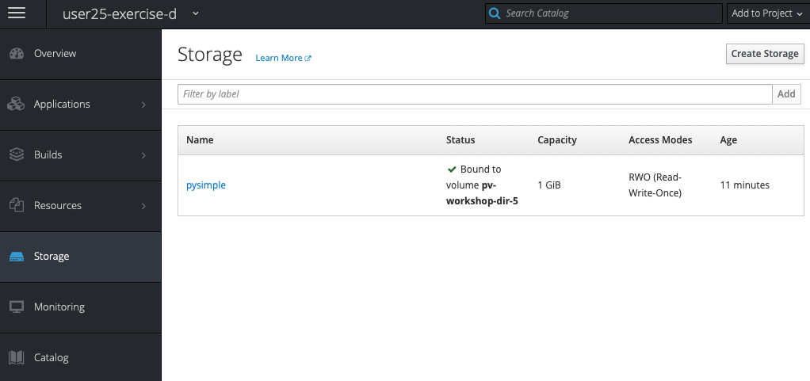

# Development Workshop - Exercise D

[toc](../README.md) | [prev](../tutorial-3/README.md) | [next](../tutorial-4/README.md)

This exercise demonstrates giving applications **Persistent Storage**.

---

We'll re-deploy the **PySimple** application but this time give it some
persistent storage so that we're able to preserve data between container
restarts.

>   Here we assume that you've successfully worked through exercises **A**
    and **B** and have the OpenShift commandline tools available and are
    logged into the workshop's OpenShift cluster.

## Move to correct location in the repo

Change directory to where the files for the exercise are located:

    cd ~/workshop/wp2-deployment-workshop-2019/exercise-d

## Login and create a project
If you're already logged in you won't need to provide your password.

    oc login -u ${WORKSHOP_USER} https://orn-master.informaticsmatters.com
    ...
    oc new-project ${WORKSHOP_USER}-exercise-d

## Claiming storage
In order to use an external (persistent) volume we need to make a _claim_.

A claim is defined using a **PersistentVolumeClaim** object. We have
created an example for you in the `exercise-d` directory, a small 1GiB
volume. Like all other objects you use the command line `process` and
`create` commands to make the claim.

    oc process -f persistent-volume-claim.yaml | oc create -f -

>   The claim belongs to a namespace (project), only containers in the named
    namespace can use the claim.

You can see the **Claim** from the **Storage** section of your project's
console: -



...or from the command-line: -

    oc get pvc
    ...
    
## Using storage in a container (Pod)
We declare `volumes` in our application **DeploymentConfig** when we want to
attach external, persistent volumes.

The **DeploymentConfig** in this exercise extends the one in **Exercise B**
by adding a `volume` declaration and a `volumeMount`.

The `volume` attaches the claim (by name) to the container: -

```yaml
volumes:
- name: pysimple
  persistentVolumeClaim:
    claimName: pysimple
```

The `volumeMount` defines its mount-point (i.e. `/data` in our case)
inside the container: -

```yaml
volumeMounts:
- mountPath: /data
  name: pysimple
```

## Deploying the application image
Just as we did with **Exercise B** let's deploy the application, which consists
of a **DeploymentConfig**, **Service** and **Route**: -

    oc process -f deployment-config.yaml | oc create -f -
    oc process -f service.yaml | oc create -f -
    oc process -f route.yaml | oc create -f -

>   This application mounts an external volume into the container's
    `/data` directory. Any material stored there is therefore persisted
    between container restarts.

## Demonstrating persistence
Let's delete the application's deployment, which stops the container and
removes the image from the project. When we re-create the application
we'lll see that, as we've not removed the **PersistentVolumeClaim**, the
disk-based files it originally created (and used by the application for a
disk-based database) are remounted into the new container.

First, let's check the current application's response with curl: -

    curl http://pysimple-${WORKSHOP_USER}-exercise-d.orn.informaticsmatters.com/

You should see `Num visits: 1`.

Lets's delete, wait and then re-create the application...

    oc delete dc/pysimple
    oc wait dc/pysimple --for=delete
    oc process -f deployment-config.yaml | oc create -f -

With the application restored, if we `curl` the application's **Route** now,
we'll see that the number of visits has been preserved,
i.e. you should see `Num visits: 2`: -

    curl http://pysimple-${WORKSHOP_USER}-exercise-d.orn.informaticsmatters.com/

The application was removed and re-deployed and its disk-based data was
persisted.

## Delete the project
Clean up by deleting the project.

To delete the PySimple project, which also deletes the **PersistentVolumeClaim**
and (in our case) the underlying storage, simply run: -

    oc delete project/${WORKSHOP_USER}-exercise-d

---

[toc](../README.md) | [prev](../tutorial-3/README.md) | [next](../tutorial-4/README.md)
