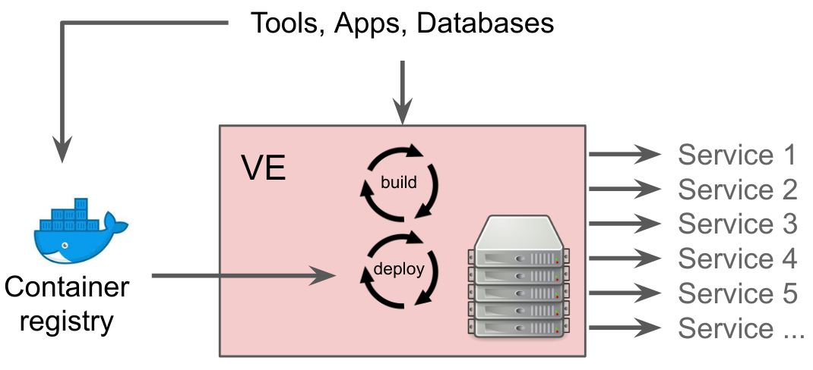
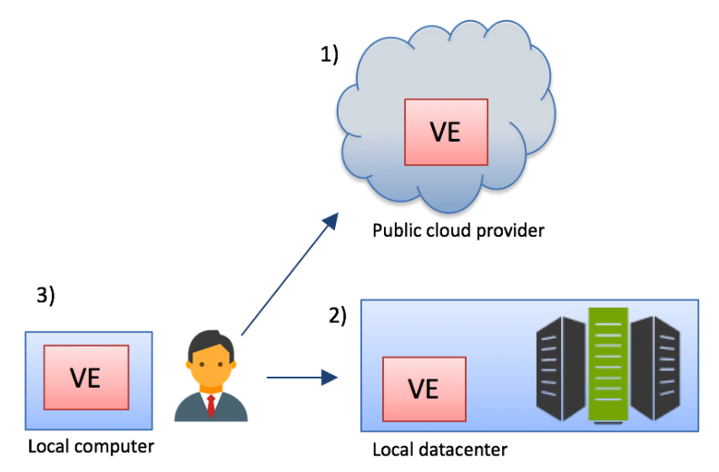
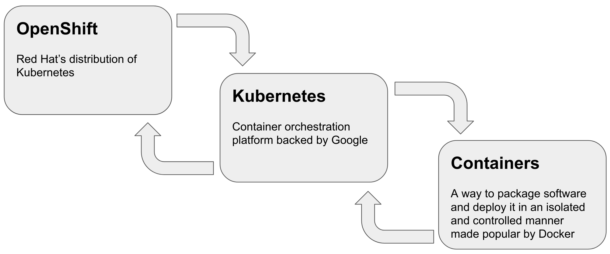

# Introduction to containers, Kubernetes and OpenShift

[toc](../README.md) | [prev](../setup/README.md) | [next](../exercise-a/README.md)

Here we provide a brief introduction to containers and explain what OpenShift is. 

---

## OpenRiskNet Virtual Environments

At the heart of the OpenRiskNet project is the concept of a `Virtual Environment` (VE), a virtualised environment
to which you can build and deploy containerised applications and make them accessible to outside parties.

A VE can be deployed to in-house hardware or to the cloud, and can be run on a single computer for testing purposes.

A OpenRiskNet VE is based on Red Hat's [OpenShift](https://www.openshift.com/) and in particular the community version
(e.g. free to use) [OKD](https://www.okd.io/). Anyone can create a OpenRiskNet VE for their own purposes free of charge
and can deploy their own applications as well as the ones that OpenRiskNet provide. This workshop shows how to deploy such
applications.

OpenShift is a distribution of [Kubernetes](https://kubernetes.io/) (K8S) which is a platform for running containers at
scale. It can be thought of as a distributed operating system for containers e.g. allows to run containers across multiple
servers without having to worry about the implementation details.

But what are *containers*?

Containers allow to package up software that allow that software to run in an
environment that is isolated from the host operating system and other containers
running on that host. Containers use core features of the Linux 
operating system such as *Namespaces* and *CGroups*.

Containers were made popular by Docker Inc, when they created simple tooling for
creating container images distributing them and running them.
Prior to this using containers was something for geeks only!
Containers are often referred to as 'Docker containers', but nowadays
there are ways to run containers without any of Docker Inc's tooling.

What Kubernetes provides beyond containers is the distributed runtime for
containers, allowing containers to be run is a robust and highly scalable
manner.

What OpenShift provides beyond Kubernetes is hardened security, a fully
fledged continuous integration and continuous development
environment which lets you build the applications form source as well as
running them, plus the option for commercial support if required. 

## OpenShift API

At the heart of OpenShift and Kubernetes (think of OpenShift as a distribution of Kubernetes with some additional functionality)
is a REST API which lets you get information from OpenShift and to make changes to the current running state. For instance you
could tell OpenShift to run a new container using a specified container image that could be located on Docker Hub.

Typically you don't interact directly with the REST API but instead use a web console or a command line interface (CLI). These
provide a more user-friendly way to work with OpenShift, and we'll be using both of these in this workshop.

The OpenShift has the concept of `users` and `projects` (an OpenShift `project` is the same as a Kubernetes `namespace`). To perform
any useful operations you need to be logged in as a user and for that user to have the appropriate permissions to perform the
operations. Running containers are also controlled in respect to what they are allowed to do.
In the environment we are using for this workshop users can create new projects, and will have admin rights
in those projects, but not in other projects created by other users unless they are specifically
granted access. Other OpenShift environments may be set up differently.

To illustrate this let's do the first hands-on exercise that shows how to run a container using the web console.

---

[toc](../README.md) | [prev](../setup/README.md) | [next](../exercise-a/README.md)
