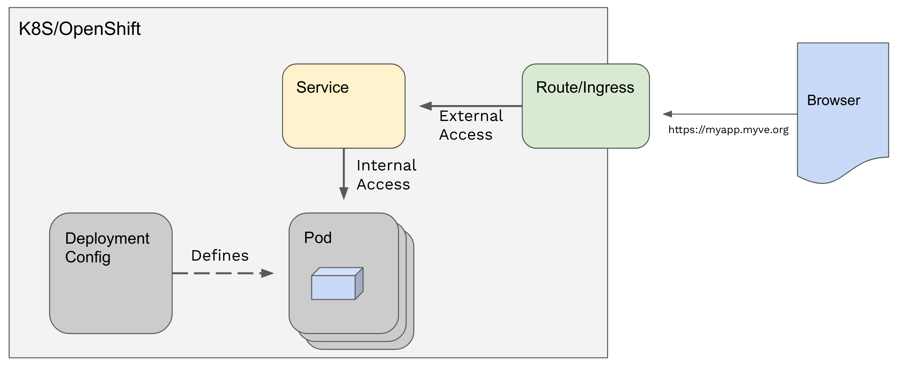

# Description of key Kubernetes objects

[toc](../README.md) | [prev](../exercise-a/README.md) | [next](../exercise-b/README.md)

Here we describe some of the key OpenShift objects and explain what happened in the last exercise. 

---

In the last exercise we just told OpenShift the name of a container image to use
and then a lot of magic happened.

We'll now explain some of this magic.

**Pods**

In Kubernetes containers run as **Pods**. A **Pod** is a wrapper for one or
more containers. The Kubernetes controllers interact with **Pods**,
which themselves control the containers running in them.
In many cases a **Pod** runs a single  container and that **Pod** can be
thought of as the running container.

**Deployments**

We can start and stop pods using the API, but we don't usually do that.
Instead we create a **DeploymentConfig** (or a Deployment) that describes the
deployment of a pod. The **DeploymentConfig** acts as a specification for what
is expected for the pod ensuring it is behaving as required.

For instance, if the pod crashes Kubernetes will restart it.
If you tell the **DeploymentConfig** that you want 3 replicas of your pod
then OpenShift will try to ensure that there are 3 running. 
If you had created a 'bare' pod then none of this would happen -
if the pod crashed it stay crashed until you  noticed and manually re-created it.

**Services**

We just introduced the concept of scaling an app through having multiple replicas.
Maybe your pod is providing an API that other pods want to use, and usage meant
that one pod could not handle all of your requests. Or maybe you wanted some
resilience so that if a pod crashed there was another identical one running
that could still handle the requests whilst the crashed pod was being replaced. 

But how would that another application know where the pods were?

This changes over time as your pod was scaled up or down or as OpenShift
relocated to the pod to a different server. To address this you don't access
pods directly, you do this through a **Service** which acts as a load-balancer
for the pods, and keeps track of where the pods are. That way you just access
the **Service** which has a location that doesn't change. The **Service**
redirects your request to one of the pods it is serving.

**Routes**

A **Route** directs traffic from outside the OpenShift cluster to the service.
The service allows traffic from *within* the cluster to arrive at the pod,
but for traffic from *outside* the cluster you need a **Route** that acts as a
proxy for the service.

When we created the **PySimple** app through the web console in [Exercise A](../exercise-a/README.md)
what happened is that OpenShift created a **DeploymentConfig** for the PySimple pod,
set the number of replicas to 1 (as well as a number of other default parameters)
and created a **Service** for that pod.

You'll recall that in Exercise A we also manually created a **Route** for the **Service**.

When you created the PySimple app OpenShift doesn't know whether you want
to route traffic from outside, and assumes you don't. Hence why you need to
manually add the route yourself.

**Creating object instances - Templates, Parameters and Objects**

>   !!!TBD!!! - describe templates, YAML and parameter and object definitions

**Summary**

The diagram above shows the relationship of the **Pod**, the **DeploymentConfig**,
the **Service** and the **Route**.

Next we will look at how to deploy PySimple using the CLI rather than the web console.

---

[toc](../README.md) | [prev](../exercise-a/README.md) | [next](../exercise-b/README.md)
